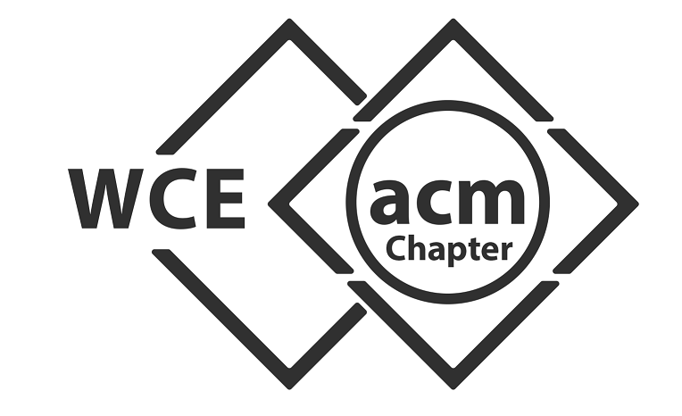

# LAB ADMIN - For Linux Computer Labs

## FEATURES:
- File Transfer
- User Information
- Loopback Functionality - Checking if Client is ON
- Basic Functionalities - Any Script

## TECHNOLOGY USED:
- Python(Qt5, Beautiful Soup): User interface and user authentication webscraping WCE Moodle.
- C Language(Sockets, IPC Message Queues): All core functionalities of application.

## INVOLVEMENT OF DATA STRUCTURES:
- Queue: Storing Requests and Responses
- Unordered Map: Storing Client Information

## LIMITATIONS:
1. Server should be listening at a predefined port number.
2. Clients may have any port number(whichever is free).

## IMPLEMENTATION:
